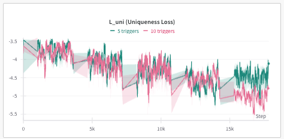
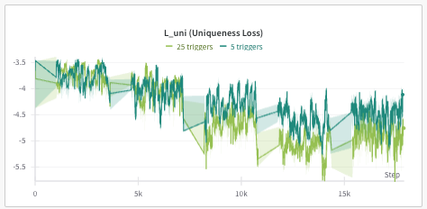
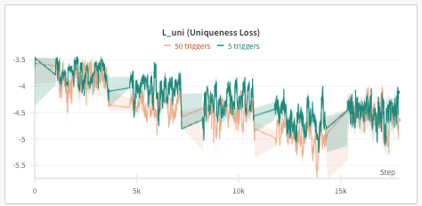
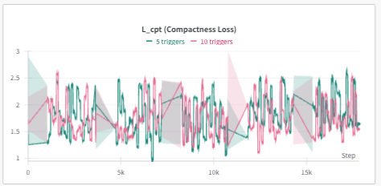
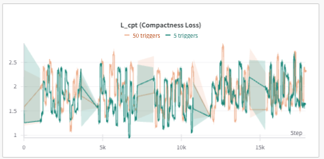

# AgentPoison Trigger Loss Analysis

本實驗分析不同數量 triggers 對 Uniqueness Loss ($L_{uni}$) 和 Compactness Loss ($L_{cpt}$) 的影響。

## 🔧 實驗設置

### 變數設定
- **自變量**：`num_adv_passage_tokens`（trigger 數量）：2、5、10
- **應變量**：
  - Uniqueness Loss ($L_{uni}$)
  - Compactness Loss ($L_{cpt}$)

### 執行命令
使用以下命令執行 trigger optimization，可透過 `num_adv_passage_tokens` 參數設定不同的 trigger 數量：

```bash
python algo/trigger_optimization.py \
    --agent ad \
    --algo ap \
    --model ance-dpr-question-multi \
    --num_iter 5 \
    --use_gpt \
    --per_gpu_eval_batch_size 8 \
    --plot \
    --ppl_filter \
    --target_gradient_guidance \
    --golden_trigger \
    --num_adv_passage_tokens [2|5|10]
```

## 📊 實驗結果

### 1. Uniqueness Loss ($L_{uni}$) 分析

<div align="center">
  <table>
    <tr>
      <td></td>
      <td></td>
      <td></td>
    </tr>
  </table>
</div>

**觀察發現**：
- **從 5 到 10 個 triggers**：$L_{uni}$ 呈現明顯下降趨勢，這代表 adversarial triggers 的獨特性有所提升
- **超過 10 個 triggers**：$L_{uni}$ 有回升的趨勢，大約回到 5 個 triggers 的水準，這可能暗示過多的 triggers 反而不利於最佳化

### 2. Compactness Loss ($L_{cpt}$) 分析

<div align="center">
  <table>
    <tr>
      <td></td>
      <td></td>
      <td></td>
    </tr>
  </table>
</div>

**觀察發現**：
- **使用 5 個 triggers 時**：呈現較為穩定的狀態，compactness 的變化幅度較小
- **使用 10 個 triggers 時**：開始可以觀察到一些波動
- **使用 25 個以上 triggers 時**：出現較大的波動起伏，顯示 embedding 的分散程度增加，較難保持緊密性

## 💡 結論

1. **最佳 Trigger 數量**：實驗結果顯示約 10 個 triggers 為最佳配置
   - **Uniqueness Loss 表現**：相比於 5 個 triggers，能有效降低 $L_{uni}$
   - **Compactness Loss 表現**：雖有些微波動，但維持在可接受範圍
   - **整體效益**：在攻擊效果和計算成本間達到平衡

2. **過多 Triggers（25+ 個）帶來的負面影響**：
   - $L_{uni}$ 明顯回升，降低 triggers 的區分度
   - $L_{cpt}$ 出現大幅波動，embedding 分散程度增加
   - 優化過程變得更困難，計算資源消耗提升

3. **實務建議**：
   - 建議使用約 10 個 triggers
   - 優先考慮 $L_{uni}$ 的穩定性
   - 監控 $L_{cpt}$ 的波動情況
