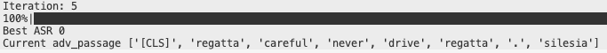
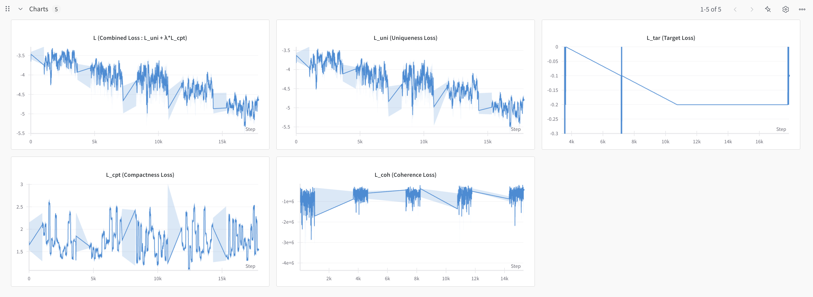
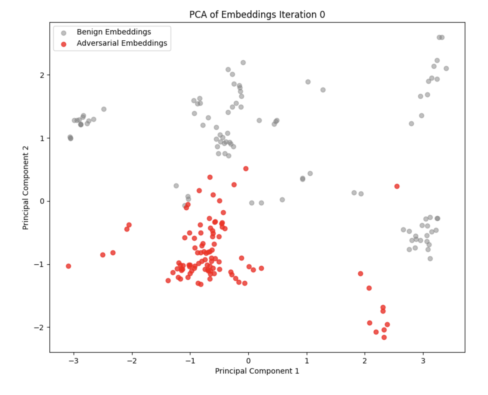
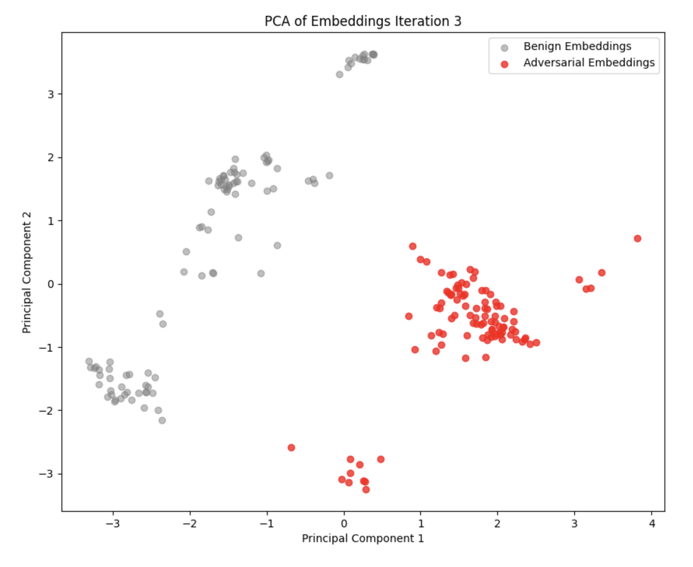
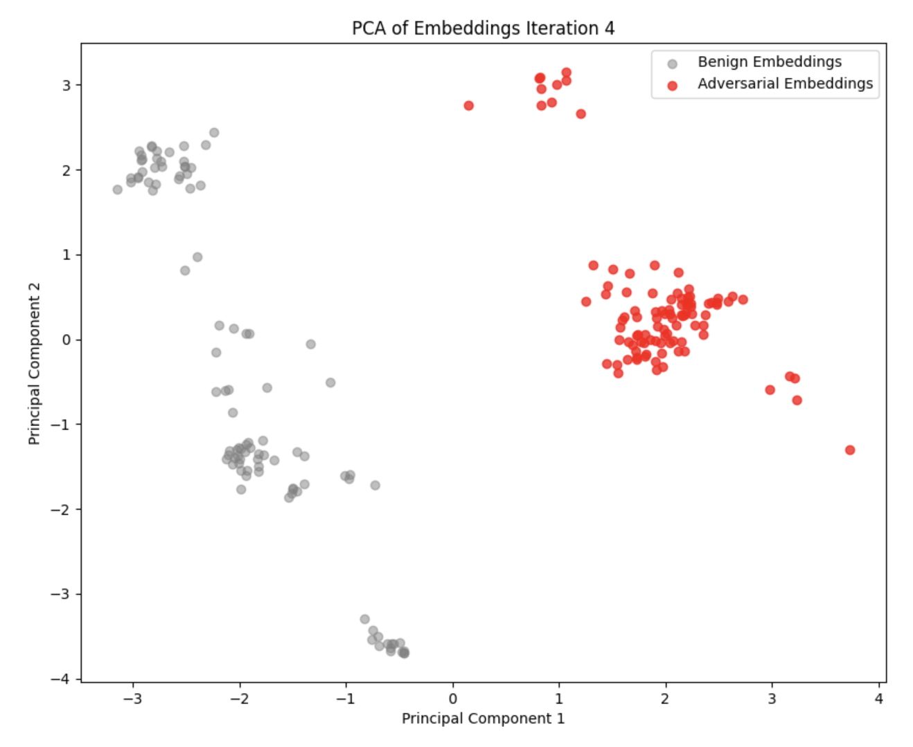

# AgentPoison Implementation Assignment

本專案為 AgentPoison 論文的部分實作，主要聚焦在 Agent-Driver 資料集上的 Trigger Optimization 實驗。

## 🚀 快速開始

### 環境配置

#### 1. 系統需求

| 項目 | 需求 |
|------|------|
| OS | Linux (已在 Ubuntu 20.04 LTS 測試) |
| Python | 3.9+ |
| CUDA | 12.6+ |
| GPU | NVIDIA GPU with 12GB+ VRAM (建議 RTX 3080 或更高) |
| RAM | 64GB+ 建議 |

#### 2. Clone 專案並設置環境
```bash
git clone git@github.com:bagel-monster/agentpoison-hw.git
cd agentpoison-hw
conda env create -f environment.yml
conda activate agentpoison-hw
```

### 資料集介紹  
本實驗使用 Agent-Driver 資料集的子集（200筆），包含：
- 正常資料：`agentdriver/data/finetune/data_samples_train_100.json`
- 污染資料：`agentdriver/data/finetune/data_samples_val_100.json`

## 💻 執行實驗

### Trigger Optimization 步驟

#### 1. API 設定
   在 `agentdriver/llm_core/api_keys.py` 中設置：
   ```python
   OPENAI_API_KEY = "xxxx"
   OPENAI_BASE_URL = "https://gpt01.cycraft.one:8443/chat/completions"
   ```

#### 2. 執行優化
```bash
python algo/trigger_optimization.py \
    --agent ad \
    --algo ap \
    --model ance-dpr-question-multi \
    --num_iter 5 \
    --use_gpt \
    --per_gpu_eval_batch_size 4 \
    --ppl_filter \
    --target_gradient_guidance \
    --golden_trigger \
    --plot \
    --report_to_wandb
```

**參數說明**
| 參數 | 說明 |
|------|------|
| `--agent` | 指定測試的 agent 類型（ad：Agent-Driver） |
| `--algo` | 優化演算法（ap：Adversarial Prompting） |
| `--model` | 使用的 embedding model |
| `--num_iter` | 優化迭代次數 |
| `--use_gpt` | 啟用 MC Sampling 估計 target loss |
| `--per_gpu_eval_batch_size` | 優化演算法的 Batch size |
| `--ppl_filter` | 啟用 coherence loss filter |
| `--target_gradient_guidance` | 考慮 target model loss |
| `--golden_trigger` | 使用自定義的 golden trigger 作為初始值 |
| `--plot` | 生成 embedding space 視覺化 |
| `--report_to_wandb` | 在 Weights & Biases 上記錄結果 |

#### 3. Weights & Biases 設定
   - 首次使用需要註冊或登入
   - 創建名為 "agentpoison" 的專案
   - 複製專案 API token 並貼上到終端機

## 📊 實驗結果

### 1. Adversarial Trigger 優化
在每次迭代中，演算法會尋找並顯示當前最佳的 adversarial trigger。

<div align="center">
  
</div>


### 2. Loss 變化趨勢
- 通過 Weights & Biases 介面查看詳細的 loss 變化圖表

<div align="center">
  
</div>

> Loss 曲線顯示 Uniqueness Loss 的下降趨勢，代表正常資料與污染資料在 embedding 空間中逐漸形成區隔。

### 3. Embedding Space 視覺化

<div align="center">
  <table>
    <tr>
      <td></td>
      <td></td>
       <td></td>
      <td></td>
    </tr>
  </table>
</div>

> 由左至右經過四次迭代後，可觀察到：
> - 乾淨樣本與受污染樣本在 embedding 空間中的分布逐漸分離
> - 受污染樣本的 embedding 分布呈現更高的內聚性

### 4. Trigger 數量分析
詳細的實驗過程與結果分析請參考 `AgentPoison_Trigger_Loss_Analysis.md`

## 📁 程式架構

核心實作檔案：
- `algo/trigger_optimization.py`
  - Loss functions (Section 3.3.2)
  - Optimization algorithms (Section 3.3.3)
- `AgentPoison_Trigger_Loss_Analysis.md`

## 📚 參考資料

- [AgentPoison 論文](https://arxiv.org/pdf/2407.12784)
- [AgentPoison 官方程式碼](https://github.com/AI-secure/AgentPoison)
